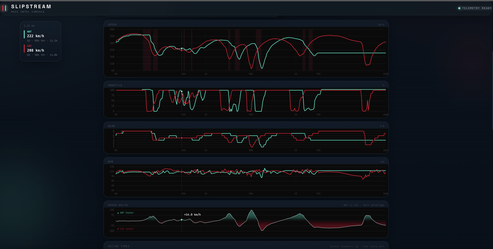
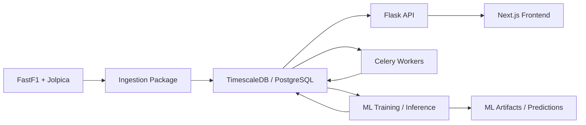

# Pitwall

**Open-source F1 post-race analytics platform.**

Qualifying telemetry, tyre strategy, race analysis, and practice intelligence — all from public data, zero paid APIs.


---

## What it does

### Qualifying — Speed Traces
Distance-aligned telemetry overlay for up to 4 drivers. Speed, throttle, brake, gear, RPM, DRS zones, sector times from timing data, and an interactive track map with braking markers. Hover any point to see all drivers' values simultaneously.

Qualifying sessions also support segment-aware comparison:
- switch between `Q1`, `Q2`, and `Q3`
- compare each driver's best telemetry lap from that segment
- drivers who did not reach the selected segment are disabled in the selector
- the UI shows the actual lap number currently being rendered per driver



### Race — Lap-by-Lap Intelligence
- **Lap time evolution** — every lap as a time series, compound-coloured dots, pit laps flagged
- **Gap to leader** — cumulative time behind P1 per lap, correct across pit windows
- **Position changes** — full field battle chart, selected drivers highlighted
- **Fastest lap card** — who set it, on what compound, how old the tyre was, top 5 with gaps
- **Pit stop analysis** — undercut/overcut verdict for each stop: position before vs 3 laps after
- **Stint pace** — clean lap averages + degradation rate (ms/lap) per stint

### Practice — Friday Intelligence
- **Gap to session best** — every lap as a dot showing gap to the fastest time of the session
- **Compound delta table** — each driver's best time per compound and gap to session fastest on that tyre
- **Tyre degradation comparison** — stint traces normalised to baseline so you see pure deg shape, all drivers overlaid
- **Compound strategy reveal** — laps per compound per team, shows planned race strategy before Sunday
- **Sector progression** — early/mid/late session sector time improvement, shows who found setup

### Championship Standings
Live driver and constructor standings from the official Jolpica F1 API. Updates every race weekend automatically — no ingestion needed for standings.

---

## Why this project exists

Pitwall is built to make high-quality F1 analysis accessible without paid telemetry feeds or closed tooling.

The goal is to give fans, builders, and contributors a practical analytics stack that can:

- ingest public motorsport data
- store it in a query-friendly schema
- expose it through clean APIs
- turn it into race-weekend intelligence in the UI

---

## Stack

```
Frontend    Next.js 16 (App Router) + Tailwind CSS v4 + inline styles
Backend     Flask 3 + SQLAlchemy
Database    TimescaleDB (PostgreSQL 15) + Redis
Data        FastF1 + Jolpica (official F1 standings)
Streaming   Apache Kafka (infrastructure ready, live mode in roadmap)
Infra       Docker Compose — zero paid services
Package mgr uv workspaces (Python monorepo)
```

---

## Project structure

```
pitwall/
├── apps/
│   ├── backend/
│   │   ├── src/backend/
│   │   │   ├── __init__.py          ← Flask app factory
│   │   │   └── api/v1/
│   │   │       ├── sessions.py      ← sessions, race-results, standings
│   │   │       ├── laps.py
│   │   │       ├── drivers.py
│   │   │       ├── telemetry.py
│   │   │       ├── strategy.py
│   │   │       ├── analysis.py      ← all race + FP analysis endpoints
│   │   │       └── predictions.py   ← ML stub (roadmap)
│   │   └── tests/                   ← backend pytest suite
│   └── frontend/
│       ├── app/
│       │   ├── page.tsx             ← Home + championship standings
│       │   ├── sessions/page.tsx    ← Session browser, grouped by GP
│       │   ├── sessions/[key]/      ← Session detail + telemetry + strategy
│       │   └── predictions/page.tsx ← ML predictions (roadmap)
│       └── components/
│           ├── analysis/
│           │   ├── RaceAnalysis.tsx
│           │   └── PracticeAnalysis.tsx
│           └── telemetry/
│               └── CornerAnalysis.tsx
├── packages/
│   └── ingestion/
│       └── src/ingestion/
│           ├── ingest_session.py    ← main entry point
│           ├── fastf1_client.py
│           ├── loader.py
│           └── models.py
├── infra/
│   ├── docker-compose.yml
│   ├── kafka/create-topics.sh
│   └── postgres/init.sql
├── pyproject.toml                   ← uv workspace root
└── Makefile
```

---

## Architecture



---

## Quickstart

### Prerequisites

- [Docker Desktop](https://www.docker.com/products/docker-desktop/)
- [uv](https://docs.astral.sh/uv/) — `curl -LsSf https://astral.sh/uv/install.sh | sh`
- [Node.js 20+](https://nodejs.org/) + [pnpm](https://pnpm.io/) — `npm i -g pnpm`

### 1. Clone and configure

```bash
git clone https://github.com/abdullah-azeemi/Pitwall.git
cd Pitwall
cp .env.example .env
```

### 2. Start infrastructure

```bash
make up
```

Starts TimescaleDB, Redis, Kafka, and MLflow. Wait ~15 seconds for TimescaleDB to initialise.

### 3. Start the backend

```bash
make backend
# API at http://localhost:8000
# Health check: curl http://localhost:8000/health
```

### 4. Start the frontend

```bash
cd apps/frontend
pnpm install
pnpm dev
# App at http://localhost:3000
```

Or from the repo root:

```bash
make frontend
```

### 5. Ingest your first session

```bash
# 2026 Australian GP — qualifying (includes telemetry for speed traces)
uv run python -m ingestion.ingest_session --year 2026 --gp "Australian" --session Q

# Race (lap times + strategy, no telemetry)
uv run python -m ingestion.ingest_session --year 2026 --gp "Australian" --session R

# Practice (for FP analysis panels)
uv run python -m ingestion.ingest_session --year 2026 --gp "Australian" --session FP2
```

FastF1 caches session data locally at `./fastf1_cache` — subsequent runs are instant.

### Qualifying segment note

For `Q1/Q2/Q3` telemetry comparisons, `lap_times.quali_segment` must exist and be populated.

If you are upgrading an existing database, run the migration first:

```bash
cd apps/backend
UV_CACHE_DIR=/tmp/uv-cache uv run alembic upgrade head
```

Then re-ingest the qualifying sessions you want to compare so both `lap_times` and `telemetry` are aligned to the stored segment metadata.

---

## Loading historical data

For the full race analysis suite, you need paired qualifying + race sessions. Each GP takes ~30–90 seconds to ingest depending on session size.

```bash
# Example: ingest a full season of key circuits
for year in 2022 2023 2024 2025; do
  for gp in "Australian" "Monaco" "British" "Italian" "Belgian"; do
    uv run python -m ingestion.ingest_session --year $year --gp "$gp" --session Q
    uv run python -m ingestion.ingest_session --year $year --gp "$gp" --session R
    uv run python -m ingestion.ingest_session --year $year --gp "$gp" --session FP2
  done
done
```

Storage estimate: ~200MB for 5 circuits × 4 seasons (lap times only, no telemetry for historical races).

**Telemetry note:** Telemetry is large, but Pitwall stores only the segment-best qualifying telemetry laps per driver (`best Q1`, `best Q2`, `best Q3`) rather than every qualifying lap. All other analysis panels (race, FP) use only `lap_times` which is compact.

### ML prediction data requirements

Pitwall's current ML pipeline predicts race finishing positions from qualifying-era information plus historical race context.

- Live prediction needs the current `Q` session.
- Historical form features need past `R` sessions in the database.
- `FP2` is optional but improves the strategy signal.
- `FP1`, `FP3`, sprint sessions, and the current race are not used for inference today.

Training is built from weekends that have both `Q` and `R` sessions. Missing `FP2` does not block training or prediction; it falls back to neutral strategy values.

See [docs/ml-race-prediction.md](./docs/ml-race-prediction.md) for the full feature-to-session map, ingest checklist, and common local failure modes.

---

## API reference

Base URL: `http://localhost:8000`

```
GET /health

# Sessions
GET /api/v1/sessions
GET /api/v1/sessions/:key
GET /api/v1/sessions/:key/race-results
GET /api/v1/sessions/:key/drivers
GET /api/v1/sessions/:key/laps?driver=<num>
GET /api/v1/sessions/:key/fastest
GET /api/v1/sessions/:key/strategy

# Standings (live from Jolpica, no ingestion needed)
GET /api/v1/standings/drivers?year=2026
GET /api/v1/standings/constructors?year=2026

# Qualifying telemetry
GET /api/v1/sessions/:key/telemetry/compare?drivers=12,63
GET /api/v1/sessions/:key/telemetry/compare?drivers=12,63&laps=12:8,63:5
GET /api/v1/sessions/:key/telemetry/stats?drivers=12,63
GET /api/v1/sessions/:key/analysis/quali-segments

# Race analysis
GET /api/v1/sessions/:key/analysis/lap-evolution?drivers=12,63
GET /api/v1/sessions/:key/analysis/gap-to-leader
GET /api/v1/sessions/:key/analysis/position-changes
GET /api/v1/sessions/:key/analysis/stint-pace
GET /api/v1/sessions/:key/analysis/undercut
GET /api/v1/sessions/:key/analysis/fastest-lap

# Practice analysis
GET /api/v1/sessions/:key/analysis/fp-scatter
GET /api/v1/sessions/:key/analysis/fp-compound-delta
GET /api/v1/sessions/:key/analysis/fp-tyre-deg
GET /api/v1/sessions/:key/analysis/fp-compounds
GET /api/v1/sessions/:key/analysis/fp-sectors
```

---

## Current launch note

Before publishing publicly, verify the quickstart on a clean machine:

- `make up`
- `make backend`
- `make frontend`
- `make seed`

That confirms infrastructure, ingestion, API routes, and the UI all work from the documented path.

## Deploy checklist

When shipping qualifying telemetry changes to Railway/Vercel:

1. Deploy backend code that matches the frontend segment logic.
2. Run DB migrations before re-ingesting:
   `cd apps/backend && UV_CACHE_DIR=/tmp/uv-cache uv run alembic upgrade head`
3. Re-ingest qualifying sessions that need `Q1/Q2/Q3` comparison so `lap_times.quali_segment` is populated.
4. Verify segment data directly:
   `GET /api/v1/sessions/:key/analysis/quali-segments`
5. Verify telemetry compare with pinned laps:
   `GET /api/v1/sessions/:key/telemetry/compare?drivers=12,63&laps=12:8,63:5`
6. Deploy the frontend after the backend is already serving the new segment data.
7. Hard refresh the client and confirm the segment tabs, disabled drivers, and lap badges update together.

## Dev commands

```bash
make up          # start Docker services (TimescaleDB, Redis, Kafka, MLflow)
make down        # stop all services
make backend     # Flask dev server on :8000
make test        # run 23 pytest tests
make db-shell    # psql into TimescaleDB
lsof -ti:8000 | xargs kill -9   # kill stuck backend port
```

---

## Design decisions

**TimescaleDB over plain PostgreSQL** — `lap_times` and `telemetry` are hypertables partitioned by time. Multi-season queries stay fast without manual partitioning.

**DELETE-then-INSERT** — TimescaleDB hypertables require the partition key in unique constraints. Rather than complex upsert logic, ingestion deletes all rows for a session before re-inserting. Safe to rerun.

**Distance-aligned telemetry** — two drivers' fastest laps have different sample counts (FastF1 samples at ~10Hz, actual count varies by car/lap). Both are interpolated to 400 evenly-spaced distance points before rendering so the overlay is spatially accurate.

**Official standings via Jolpica** — calculating points from ingested race results only works for sessions you've loaded. Jolpica gives the full season standings regardless of what you've ingested, and updates automatically after each race.

**Gap to leader via cumulative time** — uses each lap's `position = 1` driver as the leader reference. Cumulative lap times including pit laps give the true time gap. `GREATEST(0, ...)` clamps negative values from pit timing noise.

---

## Roadmap

- [ ] Race engineer style insight summaries grounded in existing analytics endpoints
- [ ] Better data quality checks and ingestion health reporting
- [ ] Bulk ingestion script — ingest full 2022–2025 archive in one command
- [ ] Auto-ingest 2026 — Celery beat task that detects new sessions and ingests automatically
- [ ] ML predictions — FLAML podium predictions from qualifying results + historical data
- [ ] What-If simulator — drag grid positions, toggle weather, rerun predictions
- [ ] Live mode — OpenF1 streaming during race weekends via Kafka

---

## Data sources

- **[FastF1](https://github.com/theOehrly/Fast-F1)** — timing, telemetry, tyre data
- **[OpenF1](https://openf1.org/)** — live timing API (roadmap)
- **[Jolpica](https://jolpi.ca/)** — official F1 standings

All data is sourced from public APIs. Pitwall stores processed data locally — no data is redistributed.

---

## Contributing

Issues and PRs welcome. If you hit ingestion errors on a circuit not listed here, open an issue with the circuit name and error — compound constraint violations are common and easy to fix.

See [CONTRIBUTING.md](./CONTRIBUTING.md) for setup and workflow expectations.

Community and repo standards:

- [CODE_OF_CONDUCT.md](./CODE_OF_CONDUCT.md)
- [SECURITY.md](./SECURITY.md)

---

## License

Apache 2.0 — see [LICENSE](LICENSE).
