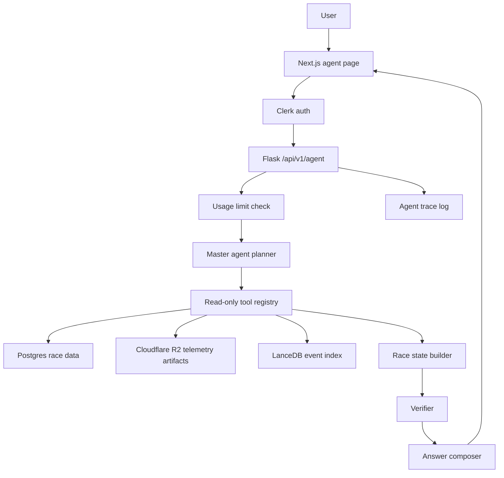

# Pitwall Agent Architecture v1

Last updated: 2026-08-17

Status: planning document. Do not implement from memory; use this file as the step-by-step guide.

## Implementation Status

Live progress log. Each lesson is a small, reviewed, committed step. Work proceeds in the order below with the student coding each file by hand.

### Completed

- L1 — Agent package skeleton.
  - Files: `apps/backend/src/backend/agent/__init__.py`, `apps/backend/src/backend/agent/types.py`
  - Typed contracts (dataclasses + enums) for all inputs/outputs and `AgentError` / `NotFoundError` / `DataError`.
  - Commit `ebd9a4f` "feat(agent): add typed tool contracts"
- L2 — First read-only tools.
  - Files: `apps/backend/src/backend/agent/tools.py` (`resolve_session`, `resolve_driver`)
  - Deterministic parameterized SQL against `sessions` / `drivers`; `NotFoundError` on miss.
  - Commit `36b1492` "feat(agent): add resolve_session and resolve_driver read-only tools"
- L3 — Pit stop detection + artifact metadata.
  - Files: `tools.py` (`find_pit_stops`, `get_lap_telemetry_artifacts`), pure `_derive_pit_stops` helper, `apps/backend/tests/test_agent_tools.py`
  - Gather-in-SQL / derive-in-Python separation; DB-free unit tests.
  - Commit `276e5ca` "feat(agent): add pit stop and telemetry artifact tools"
- L4 — Speed computation + evidence gate.
  - Files: `tools.py` (`compute_speed_window`, `verify_evidence`, plus `_mean`, `_read_artifact_speed_samples`, `_assess`), `apps/backend/tests/test_agent_evidence.py`
  - Computes telemetry-sample-mean speed before/after a stop; refusal on missing/unsupported data.
  - Commit `ee63b07` "feat(agent): add speed window computation and evidence verification"

Current test state: 43 passing (backend suite).

### Next

- L5 — Orchestrator (`apps/backend/src/backend/agent/orchestrator.py`): hardcoded demo flow chaining the tools into `run()` producing the structured answer for the Verstappen pit-stop question, no LLM.
- Then L6+ per the Implementation Plan section below.

## How To Use This Document

Use this document as the canonical v1 agent plan.

When working with another AI or a future thread, give it these instructions:

```text
Read docs/agent-architecture-v1.md first.
Do not implement a general chatbot.
Implement the phases in order.
Keep public analytics pages public.
Protect only the agent route with Clerk.
Use typed read-only tools for race data.
Do not let the LLM generate arbitrary SQL.
Do not store full race telemetry in Postgres for production.
Use R2 telemetry artifacts plus Postgres metadata.
```

If a future implementation disagrees with this file, update this file first and explain the reason in the commit or PR notes.

## Goal

Build a public Pitwall AI agent that can answer race questions from stored F1 data while keeping cost, safety, and evidence quality under control.

The first useful question we want to support is:

> On which lap did Verstappen pit, and what was his average speed before and after that stop?

That question is perfect because it forces the system to combine:

- driver identity resolution
- session/race selection
- pit-stop detection
- race lap timing
- full telemetry artifacts from R2
- computed numeric summaries
- a final answer with citations

## Decisions From Planning

- Public analytics pages can stay visible without login.
- The agent page should require Clerk auth.
- Users should have usage limits.
- Data is post-race only, not live race control.
- The agent should answer globally across F1 race data, not only one selected session.
- Only stored F1 data is allowed for now. No external web/API lookup during chat.
- Full race telemetry should be stored as artifacts in Cloudflare R2.
- Postgres should keep compact metadata and derived events, not every raw telemetry sample.
- Flask remains the backend.
- OpenRouter will be used for LLM calls later, with an initial budget cap around 5 USD.
- The master agent gets read-only data tools only.
- Answers must show evidence.
- The UI should eventually show a full tool/state trace.
- The world-model/JEPA-style layer is a later direction, after the first agent works.

## Fundamentals

### What Is RAG?

RAG means retrieval-augmented generation.

In a normal RAG app:

1. The user asks a question.
2. The system searches text chunks or embeddings.
3. The LLM writes an answer using those chunks.

That is useful for documents, but race analytics needs more than text retrieval. If a user asks for average speed before and after a pit stop, the answer must be computed from structured data and telemetry. A text chunk is not enough.

### What Pitwall Should Build Instead

Pitwall should use data orchestration.

That means the LLM is not the source of truth. The LLM is a planner and explainer. Deterministic tools do the actual data work.

The agent should:

1. Understand the question.
2. Decide which data tools are needed.
3. Call read-only tools.
4. Compute numbers using Python/SQL/tool code.
5. Verify the result.
6. Explain the result with evidence.

In short:

```text
LLM plans.
Tools compute.
Verifier checks.
LLM explains.
```

### What Is Streaming?

Streaming means the backend sends partial progress to the frontend while the agent is still working.

Without streaming:

```text
User asks -> wait 10 seconds -> full answer appears
```

With streaming:

```text
User asks
-> "Resolving driver..."
-> "Finding pit stops..."
-> "Reading telemetry artifact..."
-> "Computing before/after speed..."
-> final answer appears
```

For v1, streaming is optional. It is nice for user experience, but it makes implementation more complex. Start with a normal request/response endpoint, then add streaming once the orchestration works.

### What Are State Snapshots?

A state snapshot is a structured summary of the race at a point in time.

Example:

```json
{
  "session_key": 12345,
  "lap_number": 23,
  "driver_number": 1,
  "position": 2,
  "compound": "MEDIUM",
  "stint": 2,
  "tyre_life_laps": 4,
  "gap_to_leader_ms": 6240,
  "last_lap_ms": 93621.4,
  "avg_speed_kmh": 211.7
}
```

These snapshots are better than embeddings for v1 because they are explainable and testable.

Embeddings are useful for fuzzy search, such as "show me races where Ferrari had late tyre drop-off." But embeddings should not be the primary truth source for numeric answers.

Recommendation:

- v1: store structured state/events and use deterministic tools.
- v1.5: add embeddings over event summaries for discovery.
- v2: add learned latent/world-model features if there is enough data and a real prediction task.

## v1 Architecture



## Component Responsibilities

### Clerk

Clerk owns identity.

The frontend uses Clerk to sign in users and protect the `/agent` page. The backend verifies Clerk JWTs before allowing access to `/api/v1/agent/*`.

Pitwall still keeps a local `users` table because product state belongs to Pitwall:

- plan
- usage limits
- admin role
- created_at
- last_seen_at

Clerk answers "who is this person?" Pitwall answers "what can this person do?"

### Postgres

Postgres remains the source of truth for structured race data:

- sessions
- drivers
- lap_times
- race_results
- telemetry_artifacts
- race_intelligence_events

Do not store all race telemetry samples in Postgres for production. That will become too large.

### Cloudflare R2

R2 stores full telemetry artifacts.

Recommended artifact shape:

```text
telemetry/session_<session_key>/driver_<driver_number>/lap_<lap_number>.parquet
```

The database stores metadata only:

- session_key
- driver_number
- lap_number
- storage_key
- storage_backend
- format
- sample_count
- size_bytes
- checksum_sha256

### Race Intelligence Events

`race_intelligence_events` should hold compact derived facts.

Examples:

- pit stop events
- stint summaries
- battle windows
- degradation warnings
- pace phase summaries
- driver score inputs

For the agent, these events are the "memory cards" of a race.

### LanceDB

LanceDB is a rebuildable semantic index over race intelligence events.

Use it for fuzzy retrieval, not final math.

Good use:

> Find races where Red Bull had late stint degradation.

Bad use:

> What was Verstappen's exact average speed before pit stop lap 23?

Exact numeric answers should come from Postgres/R2 tools.

### OpenRouter

OpenRouter should be used through a small adapter layer.

Do not spread OpenRouter calls across the codebase. Put all LLM calls behind one module so models can change later.

Budget plan:

- Use a cheap/free model for routing and classification.
- Use a stronger paid model only for final synthesis or hard planning.
- Log estimated tokens and cost per request.
- Put a hard daily/monthly usage cap in app config.

## Agent Roles

v1 should use role-based stages inside Flask, not separate worker services.

This is still "agentic" because each stage has a job, state, and tools. It is just cheaper and easier to debug.

### 1. Auth Gate

Checks:

- user has a valid Clerk JWT
- user exists in local `users` table
- user has not exceeded usage limit

### 2. Question Router

Classifies the query.

Examples:

- pit stop question
- stint pace question
- telemetry comparison
- race result explanation
- cross-season comparison
- unsupported request

### 3. Clarifier

Asks a follow-up if the question is missing required information.

Example:

User asks:

> What was Verstappen's average speed before and after the pit stop?

Clarifier may need:

- Which race?
- Which pit stop, if there were multiple?
- How many laps before and after?

The system should not guess silently when the answer would change.

### 4. Planner

Turns the question into a structured plan.

Example plan:

```json
{
  "intent": "pit_stop_speed_delta",
  "session_selector": {
    "year": 2026,
    "gp_name": "Australian",
    "session_type": "R"
  },
  "driver_selector": {
    "name_or_abbr": "Verstappen"
  },
  "window": {
    "laps_before": 3,
    "laps_after": 3
  },
  "tools": [
    "resolve_session",
    "resolve_driver",
    "find_pit_stops",
    "get_lap_telemetry_artifacts",
    "compute_speed_window",
    "verify_evidence"
  ]
}
```

### 5. Tool Executor

Calls read-only tools.

Tools should be typed Python functions, not arbitrary SQL generated by the model.

The master agent may decide which tool to call, but the tool itself controls the SQL and R2 access.

### 6. Verifier

Checks that:

- the session exists
- the driver exists in that session
- pit stop laps were found
- required telemetry artifacts exist
- enough samples were loaded
- before/after windows are valid
- computed units are correct

If verification fails, the agent should refuse clearly instead of inventing.

### 7. Answer Composer

Writes the final answer.

The final answer should include:

- direct answer
- key numbers
- evidence table or citations
- caveats if data is incomplete
- optional chart/card payload for frontend

## Read-Only Tool Registry

Start with these tools.

### `resolve_session`

Purpose:

- Convert a human race reference into a `session_key`.

Input:

```json
{
  "year": 2026,
  "gp_name": "Australian",
  "session_type": "R"
}
```

Output:

```json
{
  "session_key": 12345,
  "year": 2026,
  "gp_name": "Australian Grand Prix",
  "session_type": "R"
}
```

### `resolve_driver`

Purpose:

- Convert "Verstappen", "VER", "Max", or driver number into a session-specific driver row.

Output should include:

- driver_number
- abbreviation
- full_name
- team_name

### `find_pit_stops`

Purpose:

- Find laps where `pit_in_time_ms` or `pit_out_time_ms` indicates a pit stop.

Output:

```json
{
  "driver_number": 1,
  "pit_stops": [
    {
      "stop_index": 1,
      "pit_in_lap": 22,
      "pit_out_lap": 23,
      "compound_before": "MEDIUM",
      "compound_after": "HARD"
    }
  ]
}
```

### `get_lap_telemetry_artifacts`

Purpose:

- Load telemetry artifacts for selected laps from R2 or local artifact storage.

Important:

- This tool should return compact summaries by default, not raw samples.
- Raw samples should be returned only when the frontend needs a chart.

### `compute_speed_window`

Purpose:

- Compute average speed before and after a pit stop.

Possible definitions:

- lap-time derived average speed: track length divided by lap time
- telemetry sample average: mean of `speed_kmh` samples
- distance-weighted telemetry average

Recommendation:

- For v1, use telemetry sample average if artifacts exist.
- If exact track-distance weighting is added later, label it separately.
- Always state the metric definition in the answer.

### `search_race_events`

Purpose:

- Search `race_intelligence_events` and LanceDB for related evidence.

Use for context, not final numeric computation.

### `build_race_state`

Purpose:

- Build structured state snapshots per driver/lap/stint.

This is the bridge toward a future world-model layer.

## Agent API Shape

Recommended v1 endpoints:

```text
POST /api/v1/agent/query
GET  /api/v1/agent/conversations
GET  /api/v1/agent/conversations/:id
```

Optional later:

```text
GET /api/v1/agent/runs/:id/events
```

The events endpoint is for streaming/tool traces.

## Do We Need Chat Tables in v1?

Short answer: yes, but keep them minimal.

If there are no tables, the system cannot reliably enforce usage limits, show history, debug failures, or keep private user conversations.

Recommended minimal v1 tables:

### `users`

Stores local product state for Clerk users.

Fields:

- id
- clerk_user_id
- email
- name
- avatar_url
- plan
- role
- created_at
- updated_at
- last_seen_at

### `agent_conversations`

Stores one chat thread.

Fields:

- id
- user_id
- title
- created_at
- updated_at

### `agent_messages`

Stores user and assistant messages.

Fields:

- id
- conversation_id
- role
- content
- created_at

### `agent_runs`

Stores one execution of the agent.

Fields:

- id
- conversation_id
- user_id
- status
- model
- started_at
- completed_at
- cost_estimate_usd
- error

### `agent_tool_calls`

Stores tool trace for debugging and future UI.

Fields:

- id
- run_id
- tool_name
- input_json
- output_summary_json
- status
- duration_ms
- created_at

This table is the foundation for "full tool/state trace" in the UI.

## Usage Limits

Suggested starting limits:

- free user: 10 agent questions per day
- admin: unlimited or high limit
- unauthenticated user: no agent access

Limit by:

- user_id
- rolling day
- successful and failed runs

Failed runs should count if they used the LLM. Failed auth or missing required clarification should not count.

## Admin

There should be exactly one admin initially.

Admin can:

- see full traces
- inspect costs
- rebuild event indexes
- trigger race intelligence refresh
- bypass usage limits

Normal users can:

- ask questions
- see their own conversation history
- see evidence used in their own answers

Normal users should not see:

- other users' conversations
- raw internal errors
- full SQL text if it exposes internals
- admin operations

## UI Concept

The agent page should be a real analysis workspace, not just a chat box.

Recommended layout:

- left: conversation
- right/top: race/session context
- right/middle: evidence cards
- right/bottom: tool/state trace
- optional chart panel for telemetry answers

For the Verstappen pit-stop question, the UI could show:

- Answer card: "Pit stop on lap 22/23"
- Before/after metric card
- Lap window table
- Mini speed chart
- Tool trace:
  - resolved session
  - resolved driver
  - found pit stop
  - loaded telemetry artifacts
  - computed speed window
  - verified evidence

## Example End-to-End Flow

Question:

> On which lap did Verstappen pit and what was his avg speed before and after that pit?

Step 1: Auth

- Clerk verifies the user in frontend.
- Flask verifies Clerk JWT.
- Flask loads local user by `clerk_user_id`.
- Usage limit is checked.

Step 2: Clarification

If no race is selected, the agent asks:

> Which race should I use?

If the current UI context already has a race selected, use that session.

Step 3: Plan

The planner emits:

```json
{
  "intent": "pit_stop_speed_delta",
  "driver": "Verstappen",
  "session_key": 12345,
  "window_laps": 3
}
```

Step 4: Tools

The executor calls:

1. `resolve_driver`
2. `find_pit_stops`
3. `get_lap_telemetry_artifacts`
4. `compute_speed_window`
5. `verify_evidence`

Step 5: Answer

Example answer shape:

```text
Verstappen's first stop was recorded across lap 22 into lap 23.

Using telemetry sample average speed, his 3-lap pre-stop window averaged
213.4 km/h, while the 3-lap post-stop window averaged 218.9 km/h.
That is a +5.5 km/h increase after the stop, consistent with lower fuel and
the switch from MEDIUM to HARD tyres.

Evidence:
- Session: 2026 Australian GP Race
- Driver: Max Verstappen, car 1
- Pit window: lap 22 pit-in, lap 23 pit-out
- Before laps: 19, 20, 21
- After laps: 24, 25, 26
```

If telemetry artifacts are missing:

```text
I found Verstappen's pit stop, but I cannot compute telemetry average speed
because the required race telemetry artifacts are missing for laps 19-26.
I can still answer using lap-time-derived average speed if you want that metric.
```

## Implementation Plan

This section is intentionally written as future coding instructions. Do not do all of this in one pull request.

### Phase 1: Documentation and Schema Plan

Goal:

- Agree on architecture.
- Decide v1 tables.
- Decide initial tools.

Files to update later:

- `docs/agent-architecture-v1.md`
- `docs/data-model.md`
- `docs/architecture.md`

No runtime code yet.

### Phase 2: Clerk Frontend Auth

Goal:

- Add Clerk to Next.js.
- Protect only the `/agent` route.
- Keep public analytics pages public.

Expected files:

- `apps/frontend/package.json`
- `apps/frontend/app/layout.tsx`
- `apps/frontend/middleware.ts`
- `apps/frontend/app/agent/page.tsx`

Concept:

- install Clerk Next.js package
- wrap app in Clerk provider
- configure middleware so `/agent` requires login
- send Clerk token to Flask agent API

### Phase 3: Clerk Backend Verification

Goal:

- Flask verifies Clerk JWT.
- Only authenticated users can call `/api/v1/agent/*`.

Expected files:

- `apps/backend/src/backend/config.py`
- `apps/backend/src/backend/auth.py`
- `apps/backend/src/backend/api/v1/agent.py`
- `apps/backend/src/backend/__init__.py`
- `apps/backend/pyproject.toml`

Concept:

- add Clerk issuer/JWKS config
- verify bearer token
- extract Clerk user id
- load or create local user row
- reject missing/invalid token

### Phase 4: User and Agent Tables

Goal:

- Add minimal product tables for users, conversations, messages, runs, and tool calls.

Expected file:

- new Alembic migration under `apps/backend/migrations/versions/`

Tables:

- `users`
- `agent_conversations`
- `agent_messages`
- `agent_runs`
- `agent_tool_calls`
- optional `agent_usage_daily`

### Phase 5: Race Telemetry Artifacts for Full Race

Goal:

- Store full race telemetry as R2 Parquet artifacts.
- Keep Postgres small.

Expected files:

- `packages/ingestion/src/ingestion/fastf1_client.py`
- `packages/ingestion/src/ingestion/loader.py`
- `docs/ingestion.md`
- `docs/data-model.md`

Important design:

- Race sessions should write artifacts for every driver/lap where telemetry exists.
- Qualifying can keep current selected-lap behavior unless storage budget allows more.
- DB should store only artifact metadata for production mode.

### Phase 6: Read-Only Agent Tools

Goal:

- Implement deterministic Python tools behind the agent endpoint.

Expected files:

- `apps/backend/src/backend/agent/tools.py`
- `apps/backend/src/backend/agent/types.py`
- `apps/backend/src/backend/agent/orchestrator.py`

Start with:

- `resolve_session`
- `resolve_driver`
- `find_pit_stops`
- `get_lap_telemetry_artifacts`
- `compute_speed_window`
- `verify_evidence`

### Phase 7: OpenRouter Adapter

Goal:

- One internal module handles all LLM calls.

Expected file:

- `apps/backend/src/backend/agent/llm.py`

Rules:

- no OpenRouter calls outside this module
- model names come from config
- every call logs token/cost estimate
- cheap model for routing
- stronger model for final answer if needed

### Phase 8: Agent UI v1

Goal:

- Build usable agent page.

Expected files:

- `apps/frontend/app/agent/page.tsx`
- `apps/frontend/lib/agent-api.ts`
- `apps/frontend/types/agent.ts`

Minimum UI:

- text input
- answer panel
- evidence cards
- usage remaining

Later UI:

- streaming progress
- tool trace
- charts
- conversation history

## Testing Plan

Backend tests should cover:

- unauthenticated agent request is rejected
- valid Clerk user can call agent
- usage limit blocks user after limit
- admin bypasses limit
- `resolve_driver` handles name/abbr/number
- `find_pit_stops` returns correct pit windows
- missing telemetry artifacts produce refusal
- speed window computation is deterministic
- tool calls are logged

Frontend tests should cover:

- `/agent` requires login
- public pages do not require login
- agent page sends auth token
- answer evidence cards render
- failure state is readable

## Design Justifications

### Why Auth Only the Agent?

Public analytics pages help discovery. The agent costs money because it uses LLM calls and potentially loads telemetry artifacts. Protecting only the agent gives the best balance between growth and budget control.

### Why Keep Local Users If Clerk Exists?

Clerk is identity infrastructure. Pitwall still needs product-specific data.

Examples:

- plan
- role
- usage count
- admin flag
- local conversation ownership

That data should not live only in Clerk metadata.

### Why Typed Tools Instead of Free SQL?

Free SQL is risky.

Even if the LLM is instructed to be read-only, mistakes can happen. Typed tools make the allowed actions explicit and testable.

The LLM can choose:

```text
call find_pit_stops
```

But it cannot invent:

```sql
DROP TABLE ...
```

### Why Store Tool Calls?

Tool calls are the audit trail.

They help with:

- debugging wrong answers
- showing the user evidence
- calculating cost
- building the future trace UI
- improving prompts/tools later

Store summaries, not huge raw telemetry blobs.

### Why Structured State Before World Model?

A real world model needs training data, targets, evaluation, and iteration.

Structured state snapshots are the practical first step because they:

- are explainable
- are cheap
- can be tested
- support current user questions
- can later become training data

This is how the future world-model path begins without pretending the first chatbot is already JEPA.

## Open Questions

- Exact Clerk package versions and env variable names.
- Exact OpenRouter model choices.
- Whether v1 should stream progress or return a single response.
- Whether usage limits are daily, monthly, or both.
- Whether normal users can see full tool traces or only simplified evidence.
- How many telemetry laps around a pit stop should be loaded by default.
- Whether speed should be sample mean or distance-weighted mean.

## Recommended Next Step

The read-only tool layer (L1–L4) is done and committed. The five v1 constants below are still open but not blocking the orchestrator (the demo flow can use local defaults until decide later):

1. Free daily agent question limit.
2. Admin Clerk user id or admin email.
3. Default OpenRouter routing model.
4. Default OpenRouter final-answer model.
5. Default pit-stop comparison window, such as 3 laps before and 3 laps after.

Implement in this order (see Implementation Status for what is done):

1. [done] Typed tool contracts.
2. [done] Read-only tools without LLM (`resolve_session`, `resolve_driver`, `find_pit_stops`, `get_lap_telemetry_artifacts`, `compute_speed_window`, `verify_evidence`).
3. Orchestrator: one hardcoded demo query flow (no LLM).
4. Flask agent endpoint `POST /api/v1/agent/query` + tool trace logging.
5. Minimal user/agent tables (users, conversations, messages, runs, tool_calls).
6. OpenRouter adapter, then planner/composer.
7. Clerk route protection for `/agent`.
8. Flask Clerk JWT verification.
9. Evidence cards and trace UI.

## Session Handoff (compact log)

Teaching-mode build: the student types every file by hand, then the mentor checks, fixes, writes tests, and commits. One lesson per commit.

### Established conventions (do not break)

- Tools live in `apps/backend/src/backend/agent/tools.py`; contracts in `types.py`; SQL uses `text()` + bound params (`:name`), never f-strings.
- Every tool takes one frozen input dataclass, returns one frozen output dataclass.
- Errors are typed: `NotFoundError` = gone, `DataError` = unusable/unsupported. Verifier refusal paths use `DataError`.
- Rule of thumb: SQL gathers, pure Python derives. Pure helpers (e.g. `_derive_pit_stops(rows)`), take `list[dict]` and no DB, so they are DB-free unit-testable.
- Determinism: `ORDER BY` everywhere, `round(x, 2)` for numbers, one query per tool where possible (single `ANY(:laps)` instead of repeated lookups).
- Dev DB (docker `make up`) currently has only 2024 British GP Qualifying session 9554, 20 drivers, 0 lap rows, and no `telemetry_artifacts` table — integration tests seed their own data in a test DB instead.
- `extensions.engine` is only set inside `create_app()`; standalone scripts must `create_engine(settings.db_url)` first, and pytest integration tests must depend on the `app` fixture.
- House quality commands: `uv run ruff check`, `uv run ruff format --check`, `uv run pytest apps/backend/tests/`.

### Mentoring notes (bugs caught this session)

- `gzip.open(path, "rt")` reads text; `.read().decode()` then fails — use `"rb"`.
- Don't default mutable values to `[]` in dataclasses — `field(default_factory=list)` (here, tuples with `()`).
- `conn.execute(...).first() is not None` is the cheap existence check.
- Typo `extensions` vs `extentions` and a renamed input field (`name_or_abbreviation`) both caused runtime crashes — always grep `ruff check` + `py_compile` after hand-typing.

### Decided v1 values used so far

- Metric: `TELEMETRY_SAMPLE_MEAN` only (`compute_speed_window` refuses others with `DataError: unsupported metric`).
- Pit stop signal: `pit_in_time_ms IS NOT NULL` = entry lap, first later lap with `pit_out_time_ms IS NOT NULL` = exit lap (fallback: entry + 1).
- Speed delta positive = faster after the stop.
