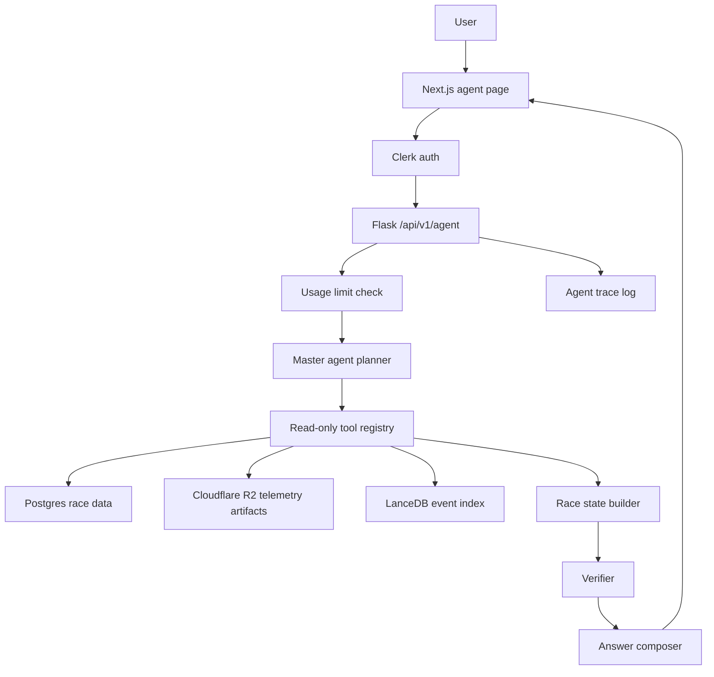

# Pitwall Agent Architecture v1

Last updated: 2026-08-27 (L24)

Status: planning document. Do not implement from memory; use this file as the step-by-step guide.

## Implementation Status

Live progress log. Each lesson is a small, reviewed, committed step. Work proceeds in the order below with the student coding each file by hand.

### Completed

- L1 — Agent package skeleton.
  - Files: `apps/backend/src/backend/agent/__init__.py`, `apps/backend/src/backend/agent/types.py`
  - Typed contracts (dataclasses + enums) for all inputs/outputs and `AgentError` / `NotFoundError` / `DataError`.
  - Commit `ebd9a4f` "feat(agent): add typed tool contracts"
- L2 — First read-only tools.
  - Files: `apps/backend/src/backend/agent/tools.py` (`resolve_session`, `resolve_driver`)
  - Deterministic parameterized SQL against `sessions` / `drivers`; `NotFoundError` on miss.
  - Commit `36b1492` "feat(agent): add resolve_session and resolve_driver read-only tools"

- L3 — Pit stop detection + artifact metadata.
  - Files: `tools.py` (`find_pit_stops`, `get_lap_telemetry_artifacts`), pure `_derive_pit_stops` helper, `apps/backend/tests/test_agent_tools.py`
  - Gather-in-SQL / derive-in-Python separation; DB-free unit tests.
  - Commit `276e5ca` "feat(agent): add pit stop and telemetry artifact tools"
- L4 — Speed computation + evidence gate.
  - Files: `tools.py` (`compute_speed_window`, `verify_evidence`, plus `_mean`, `_read_artifact_speed_samples`, `_assess`), `apps/backend/tests/test_agent_evidence.py`
  - Computes telemetry-sample-mean speed before/after a stop; refusal on missing/unsupported data.
  - Commit `ee63b07` "feat(agent): add speed window computation and evidence verification"
- L5 — Orchestrator.
  - Files: `orchestrator.py` (`_classify`, `_execute` with inner `record` trace wrapper, `_compose`, `run`); new `Plan`, `ToolCallRecord`, `AgentAnswer` contracts in `types.py`.
  - Hardcoded demo flow (no LLM): classify -> execute -> verify -> compose; every tool call recorded as a `ToolCallRecord` in the trace; typed refusals instead of invented numbers.
  - Deviation from this doc: the hardcoded demo plan targets 2026 Monaco GP Race / Carlos Sainz (not Verstappen) until the LLM planner lands in L6+.
  - Tests: `apps/backend/tests/test_agent_orchestrator.py` — happy path (215.0/255.0 km/h, +40.0 delta, 6-tool trace), missing-artifact refusal, unsupported-question.
- L6 — Agent HTTP endpoint.
  - Files: `apps/backend/src/backend/api/v1/agent.py` (`agent_bp`, `POST /agent/query`), registered in `__init__.py` under `/api/v1`.
  - Thin endpoint: validate JSON body -> `orchestrator.run(question)` -> structlog tool-trace lines (`agent.tool_call`) + run summary -> `jsonify(asdict(answer))`.
  - Tests: `apps/backend/tests/test_agent_api.py` — happy path over HTTP, empty-body 400, unsupported-question 200.
- L7 — Minimal user/agent tables.
  - Files: `apps/backend/migrations/versions/0019_add_agent_tables.py` (`users`, `agent_conversations`, `agent_messages`, `agent_runs`, `agent_tool_calls`); synced `0013`–`0018` from `ml-driver-feature` so the branch migration chain matches the dev DB (was at `0018`).
  - JSONB for tool-call input/output summaries (never raw telemetry blobs); FKs model ownership; downgrade is the exact reverse.
  - Verified: `alembic upgrade head`, table listing, `downgrade -1` + re-upgrade round-trip.
- L8 — Persist runs + tool-call traces.
  - Files: `apps/backend/src/backend/agent/persistence.py` (`ensure_user`, `_insert_tool_call`, `persist_run`); endpoint `agent.py` now records `started_at`, persists, and logs `run_id`.
  - No Clerk auth yet, so runs attach to a seeded `demo-user` row (`INSERT ... ON CONFLICT (clerk_user_id) DO NOTHING`); run + trace inserts share one `engine.begin()` transaction; JSONB written as `json.dumps(...)` strings (matches `race_vector_index.py` convention — psycopg can't adapt a dict param in a raw `text()` statement).
  - Tests: `test_agent_api.py` — happy path persists a `completed` run + 6 tool-call rows; unsupported question persists a `refused` run.

- L9 — OpenRouter adapter.
  - Files: `apps/backend/src/backend/agent/llm.py` (`_post`, `_chat`, `_estimate_cost`, `route_question`, `compose_answer`), `LLMError` in `types.py`, OpenRouter settings in `config.py`, `apps/backend/tests/test_agent_llm.py`.
  - All LLM calls live in this one module. stdlib `urllib` (no new dependency); `_post` is the only network-touching function so tests monkeypatch it. Every call logs `agent.llm` with token counts + `cost_estimate_usd` (OpenRouter `usage.cost` when present, else price-table estimate; unknown models = 0.0). `route_question` validates the model output against real `Intent` values; anything else is a typed `LLMError`.
  - Decided v1 constants: routing model `openai/gpt-4o-mini`, final-answer model `openai/gpt-4o-mini` (both config overridable). OpenRouter key via `OPENROUTER_API_KEY`.
  - Tests: 10 DB-free unit tests (monkeypatch `_post`), happy paths + unparseable/unknown intent + missing key + cost estimation.
  - Commit `93c462a` "feat(agent): add OpenRouter adapter"
- L10 — LLM-planned orchestrator.
  - Files: `apps/backend/src/backend/agent/orchestrator.py` (`_classify` removed; `_build_plan`; composer wiring in `_compose`; routing + typed refusal in `run`), `apps/backend/tests/test_agent_orchestrator.py`, `apps/backend/tests/test_agent_api.py`.
  - `run()` routes via `llm.route_question`; router outage returns typed refusal `llm_router_unavailable` (no silent keyword fallback). Final answer written by `llm.compose_answer`; on `LLMError` it falls back to the deterministic template so verified numbers survive an LLM outage. LLM calls stay out of the tool trace (logged separately as `agent.llm`).
  - Known deviation kept: plan selectors remain v1 defaults (2026 Monaco / Sainz / 3+3 laps) until the router extracts entities.
  - Tests: orchestrator + API tests now mock both LLM seams (`route_question`, `compose_answer`) so the suite stays offline-deterministic; +2 tests (template fallback, router-failure refusal).
  - Live runs need `OPENROUTER_API_KEY` in `.env`.

- L11 — Router entity extraction.
  - Files: `types.py` (`RoutedQuestion` contract), `llm.py` (router prompt extracts entities; `route_question` returns `RoutedQuestion`; `_clean_str` / `_coerce_year` / `_coerce_window` parse guards), `orchestrator.py` (`_build_plan(routed)` replaces the Monaco/Sainz defaults; Clarifier-lite refusals `missing_driver` / `missing_race` in `run`).
  - Router never guesses a race. Bad year -> `LLMError`; string years coerced to int; window clamped to 1-10, default 3.
  - Tests: +3 router edge cases (string year coercion, bad year, window clamp) + null-entity routing assertions + 2 clarifier refusals; all fakes build `RoutedQuestion` with real `Intent` members so mocks match the production contract.

- L12 — Free-tier daily usage limit.
  - Files: `config.py` (`agent_free_daily_limit`, env `AGENT_FREE_DAILY_LIMIT`), `persistence.py` (`count_runs_today()` off `started_at >= date_trunc('day', NOW())`), `api/v1/agent.py` (429 guard fires before `orchestrator.run` — blocked requests cost zero tokens and persist nothing), `.env.example`.
  - Global bucket until Clerk identities land; refused runs count too (routing alone spends tokens).
  - Tests: limit=0 blocks the very first request without seeding; limit=1 allows one then blocks, proving the counter reads fresh writes.

- L13 — Clerk backend verification (Phase 3).
  - Files: new `auth.py` (`ClerkAuthError`; `verify_session_token()` via PyJWT `PyJWKClient` — JWKS fetched/cached, RS256 + issuer + expiry enforced, audience check off per Clerk's session-token format), `config.py` (`clerk_issuer`, `clerk_admin_user_ids`), `persistence.py` (`persist_run(answer, started_at, clerk_user_id)` replaces the demo-user constant; `count_runs_today(clerk_user_id)` joins through `users`), `api/v1/agent.py` (blueprint-level `before_request`: bearer header required, verified id stored on `g`, OPTIONS passthrough for CORS preflight, 401 before payload validation or any LLM spend; `_admin_ids()` bypasses the limit), `.env.example`.
  - Dependency added: `pyjwt[crypto]`.
  - Tests: 401 on missing/invalid tokens; every endpoint test authenticates via the mocked verifier seam (header-presence logic stays real); per-user bucket proven — same day, alpha blocked at limit while beta still gets 200s.

- L14 — Clerk frontend auth (Phase 2).
  - Files: `apps/frontend/package.json` (`@clerk/nextjs`, installed app-local), root `layout.tsx` wraps `<ClerkProvider>`, new `middleware.ts` (`clerkMiddleware()` supplies auth context only — path rules removed per Clerk's resource-based guidance), `app/agent/layout.tsx` (`auth.protect()` guards server-side before the client page mounts), catch-all `sign-in/[[...sign-in]]` / `sign-up/[[...sign-up]]`, `app/agent/page.tsx` (question box → `useAuth().getToken()` Bearer JWT → Flask), `lib/api.ts` exports `API_URL`.
  - Env split: publishable/secret keys in frontend `.env.local`; `CLERK_ISSUER` in backend `.env` — both sides must name the same instance domain.
  - Gotchas hit and fixed: duplicate env var lines (last wins), route slug collision (`[[...rest]]` vs `[[...sign-in]]` under one parent is a boot error), dependency accidentally installed at repo root resolving silently via upward traversal.

- L15 — Polished agent console UI (Phase 8 first pass).
  - Files: `apps/frontend/app/agent/page.tsx`, `apps/frontend/components/agent/EvidenceCards.tsx`, `apps/frontend/components/agent/RefusalBanner.tsx`, `apps/frontend/components/agent/ToolTraceAccordion.tsx`, `apps/frontend/types/agent.ts`.
  - Replaced the simple one-shot question form with a responsive race-ops workspace inspired by the attached orchestration-console reference: grid-paper background, left agent/system status panel, central conversation/pipeline lane, right runtime log/context panel, suggested queries, loading pipeline cards, local in-page turn history, evidence cards, refusal banner, and expandable tool trace.
  - Typography adjusted back toward the project default (`Inter` / normal product UI) with monospace reserved for tool IDs, durations, and numeric telemetry values.
  - Still client-local only: conversation turns are not persisted to `agent_conversations` / `agent_messages`; daily usage remaining is represented as static UI copy until a usage endpoint exists.
  - Verified: `npm run lint`, `npm run build`. Build completes, with existing `ECONNREFUSED` fetch noise from other prerendered data-backed pages when the backend is not running.

- L16 — Conversation persistence.
  - Files: `apps/backend/src/backend/agent/persistence.py` (`create_conversation`, `insert_message`, `list_conversations`, `get_conversation_messages`; `persist_run` gains `conversation_id` param), `apps/backend/src/backend/api/v1/agent.py` (`POST /agent/query` auto-creates conversations + stores both messages + links runs; `GET /agent/conversations` lists user threads; `GET /agent/conversations/:id` returns full message history with ownership check), `apps/backend/tests/test_agent_persistence.py` (7 unit tests), `apps/backend/tests/test_agent_api.py` (+6 integration tests), `apps/frontend/types/agent.ts` (`ConversationSummary`, `ConversationDetail`, `conversation_id` on `AgentAnswer`), `apps/frontend/lib/api.ts` (`agentApi.listConversations`, `agentApi.getConversation`), `apps/frontend/app/agent/page.tsx` (conversation history panel in left sidebar, "New" button, click-to-load past conversations, follow-up questions continue the same thread via `conversation_id`).
  - Tables `agent_conversations` and `agent_messages` (migration 0019) are now fully wired: every query creates a conversation, stores both messages, and links the run. Ownership enforced on all reads.
  - Verified: `uv run ruff check`, `uv run ruff format`, frontend `npm run lint`, `npx tsc --noEmit`, `npm run build`. Integration tests require `make up` (Postgres).

- L17 — Usage remaining API + frontend wiring.
  - Files: `persistence.py` (`get_usage_summary`), `api/v1/agent.py` (`GET /agent/usage`), `types/agent.ts` (`UsageInfo`), `lib/api.ts` (`agentApi.getUsage`), `app/agent/page.tsx` (usage state, fetch on mount + after query, live `remaining / limit` in right panel replacing hardcoded cap).
  - Reuses `count_runs_today` + `settings.agent_free_daily_limit`; no new SQL.
  - Verified: backend lint, frontend typecheck clean.

- L18 — LLM cost tracking + admin stats surface.
  - Files: `types.py` (`AgentAnswer.cost_usd: float = 0.0`), `llm.py` (`route_question` returns `(RoutedQuestion, float)`, `compose_answer` returns `(str, float)` — both now return cost alongside result), `orchestrator.py` (captures `routing_cost` + `compose_cost`, accumulates via `dataclasses.replace`), `persistence.py` (`persist_run` writes `cost_estimate_usd` to DB; new `get_admin_stats()` aggregates runs/cost/status), `api/v1/agent.py` (`GET /agent/admin/stats` with 403 admin guard), `types/agent.ts` (`AdminStats`), `lib/api.ts` (`agentApi.getAdminStats`), `app/agent/page.tsx` (`adminStats` state, admin panel with runs/cost/completed/refused metrics).
  - Cost pipeline complete: LLM module computes per-call cost → orchestrator sums routing + composition → persistence writes to `agent_runs.cost_estimate_usd` → admin endpoint reads it.
  - Verified: backend lint + import check, frontend typecheck clean.

- L19 — Distance-weighted speed metric.
  - Files: `tools.py` (+`_weighted_mean`, +`_read_artifact_speed_and_distance` reading `distance_m` alongside `speed_kmh`; `compute_speed_window` accepts `DISTANCE_WEIGHTED_TELEMETRY`), `orchestrator.py` (default metric changed to `DISTANCE_WEIGHTED_TELEMETRY`), `EvidenceCards.tsx` (metric name shown in speed delta card), `test_agent_tools.py` (+3 `_weighted_mean` unit tests).
  - Distance-weighted mean weights each telemetry sample by the distance it covers, giving the true average speed over distance traveled. Falls back gracefully when `distance_m` is absent (total weight = 0 → `DataError`).
  - Verified: `uv run ruff check`, `uv run ruff format`, frontend `npx tsc --noEmit`.

- L20 — Streaming progress, agent telemetry chart, and trace visibility policy.
  - Backend: `POST /api/v1/agent/query/stream` streams Server-Sent Events (`progress`, `final`, `error`, `done`) while preserving the existing `POST /agent/query` JSON endpoint.
  - Orchestrator: `run(question, progress=...)` emits route, plan, tool, and compose progress without changing deterministic tool outputs.
  - Frontend: agent UI prefers the streaming endpoint, renders a live progress rail during runs, and shows a compact before/after speed comparison graph from the verified `speed_window` payload.
  - Design decision: non-admin users see a simplified evidence trail; admins see full tool input/output summaries. Raw telemetry blobs remain out of the API response for everyone.
  - Tests: API coverage for normal-user trace redaction, admin full trace visibility, and SSE progress/final delivery.

- L21 — Race telemetry ingestion for agent evidence.
  - `make seed` now ingests 2024 British GP Race telemetry as local file artifacts instead of skipping it.
  - Race sessions are allowed through telemetry extraction; qualifying still stores selected segment-best laps by default.
  - `load_laps()` now persists `pit_in_time_ms`, `pit_out_time_ms`, `stint`, `fresh_tyre`, `deleted_reason`, and `is_accurate`, so real ingested race data can drive pit-stop detection.
  - Design reason: the agent’s v1 pit-stop speed question needs Race (`R`) lap markers plus telemetry artifacts for the before/after lap windows.

- L22 — GP name entity normalization, pit intent routing fix, and parallelized telemetry ingestion.
  - Files: `apps/backend/src/backend/agent/tools.py` (`resolve_session` strips "GP" and "Grand Prix" suffixes and searches both `gp_name` and `country`), `apps/backend/src/backend/agent/llm.py` (`_ROUTER_SYSTEM_PROMPT` clarified so all pit queries route to `pit_stop_speed_delta` and entity extraction returns clean Grand Prix names), `packages/ingestion/src/ingestion/loader.py` (`_load_telemetry_files` uploads artifacts concurrently via `ThreadPoolExecutor` for fast session seeding), `apps/backend/src/backend/agent/persistence.py` & `apps/backend/src/backend/api/v1/agent.py` (dynamic `extensions.engine` access to avoid uninitialized references).
  - Tests: `apps/backend/tests/test_agent_orchestrator.py` (+GP suffix resolution test, cost tuple signatures), `apps/backend/tests/test_agent_llm.py`, `apps/backend/tests/test_agent_persistence.py`.
  - Current test state: 92/92 backend tests passing, frontend typecheck and build clean.

- L23 — Expanded Tool Registry.
  - Files: `apps/backend/src/backend/agent/tools.py` (`inspect_lap_events`, `stint_degradation_scanner`, `telemetry_inspector`), pure helpers (`_detect_lap_anomalies`, `_find_cliff_lap`, `_compute_stint_degradation`, `_read_artifact_full_channels`, `_resample_telemetry`, `_compute_trace_stats`); contracts in `types.py`; tests in `apps/backend/tests/test_agent_tools.py`.
  - Lap anomaly reason vocabulary: `pit_stop`, `rain_onset`, `yellow_flag_vsc`, `unknown_slowlap`; stint degradation uses OLS slope + cliff detection (>2.5σ, ≥3 clean laps); telemetry inspector resamples full channels to ≤`max_samples_per_lap` and reads Parquet/JSON from local or R2.
  - Commit `af493e9` "feat(agent): finish inspect_lap_events, stint_degradation_scanner, telemetry_inspector". Delivery record: `docs/L23-continuation.md`.

- L24 — Dynamic DAG Planner & concurrent runner.
  - Files: `apps/backend/src/backend/agent/orchestrator.py` (`build_dag`, `topo_sort`, `_execute_dag` with `ThreadPoolExecutor(max_workers=4)`, `_TOOLS`/`_BINDERS` registries via `@_register`, rewritten `_compose`/`run`), `types.py` (`DAGNode`/`DAGEdge`/`ExecutionDAG`, `RoutedQuestion.compare_driver_name` + `target_lap`, `ToolCallRecord.node_id`), `llm.py` (router covers all four intents, `_coerce_target_lap`/`_coerce_compare_driver`), tests in `apps/backend/tests/test_agent_dag.py`.
  - Unknown intents and queries missing driver/race/lap/compare-driver produce typed early refusals; any node failure fails closed (dependents get `dependency failed` records, `verify` never runs, answer refused); trace re-sorted to graph order for deterministic output.
  - Commit `2a09e78` "feat(agent): replace fixed pipeline with dynamic ExecutionDAG planner and concurrent runner". Delivery record: `docs/L24-continuation.md`.

### Next

- **L25 — Visual Thinking Graph UI**: Build n8n/React Flow interactive reasoning graph canvas with live SSE execution pulses.
- **L26 — Node Inspector Drawer**: Add click-to-inspect on graph nodes to view executed SQL queries, durations, and structured evidence.
- **L27 — Rich Multi-Channel Telemetry Visualizations**: Interactive speed/throttle/brake traces, 2D GPS track map heatmaps, and tyre degradation curves.

---

## Agentic System Evolution: Dynamic Multi-Tool DAG & Visual Thinking Graph

### 1. Architectural Overview & Vision

The v1 agent established strict foundational invariants:
1. **Typed Tool Contracts**: Every tool consumes a frozen dataclass and returns a frozen dataclass.
2. **Parameterized Read-Only SQL**: Safe, deterministic execution without raw LLM-generated SQL risks.
3. **Evidence Gate & Zero Hallucinations**: Verifiers validate fact availability before answer composition.
4. **Cloudflare R2 Telemetry Artifacts**: High-frequency telemetry stored as compressed Parquet files with metadata in PostgreSQL.
5. **SSE Progress Streaming & Cost Tracking**: Token accounting and streaming state delivery.

The next evolution transforms the linear pipeline into a **full dynamic multi-tool agentic system with a visual reasoning DAG canvas (n8n / React Flow style)** capable of answering complex, multi-faceted race engineering questions (e.g. lap incidents, tyre degradation cliffs, telemetry overlays, and undercut strategy deltas).

```
                       ┌──────────────────────────────────────────────┐
                       │             MASTER ORCHESTRATOR              │
                       │           (LLM Dynamic DAG Planner)          │
                       └──────────────────────┬───────────────────────┘
                                              │
         ┌────────────────────────────────────┼────────────────────────────────────┐
         │ (Branch 1)                         │ (Branch 2)                         │ (Branch 3)
         ▼                                    ▼                                    ▼
┌─────────────────────────────┐  ┌─────────────────────────────┐  ┌─────────────────────────────┐
│       RESOLVE SESSION       │  │       RESOLVE DRIVER        │  │      INSPECT LAP EVENTS     │
│   "British Grand Prix 2024" │  │     "Carlos Sainz (#55)"    │  │    "Lap 34 Anomaly Scan"    │
│   SQL: sessions table       │  │     SQL: drivers table      │  │    SQL: lap_times & weather │
│   ✅ 12ms                   │  │     ✅ 8ms                  │  │    ✅ 24ms                  │
└──────────────┬──────────────┘  └──────────────┬──────────────┘  └──────────────┬──────────────┘
               │                                │                                │
               └────────────────────────────────┼────────────────────────────────┘
                                                │
                                                ▼
                                 ┌─────────────────────────────┐
                                 │     TELEMETRY INSPECTOR     │
                                 │   (Speed/Throttle/Brake)    │
                                 │   Parquet: R2 Artifact Scan │
                                 │   ✅ 45ms                   │
                                 └──────────────┬──────────────┘
                                                │
                                                ▼
                                 ┌─────────────────────────────┐
                                 │   EVIDENCE GATE VERIFIER    │
                                 │  (Zero-Hallucination Gate)  │
                                 │   ✅ 2ms                    │
                                 └──────────────┬──────────────┘
                                                │
                                                ▼
                                 ┌─────────────────────────────┐
                                 │    SYNTHESIZER & DEBRIEF    │
                                 │  Final Text + Telemetry Plot│
                                 └─────────────────────────────┘
```

---

### 2. Typed Data Contracts (`apps/backend/src/backend/agent/types.py`)

Every tool, event, and DAG structure is defined with immutable dataclasses and enums.

```python
from __future__ import annotations
from dataclasses import dataclass, field
from enum import Enum
from typing import Any

class Intent(str, Enum):
    PIT_STOP_SPEED_DELTA = "pit_stop_speed_delta"
    LAP_EVENT_INVESTIGATION = "lap_event_investigation"
    TYRE_DEGRADATION_ANALYSIS = "tyre_degradation_analysis"
    TELEMETRY_COMPARISON = "telemetry_comparison"
    STRATEGY_UNDERCUT_ANALYSIS = "strategy_undercut_analysis"
    UNSUPPORTED = "unsupported"

class ToolName(str, Enum):
    RESOLVE_SESSION = "resolve_session"
    RESOLVE_DRIVER = "resolve_driver"
    FIND_PIT_STOPS = "find_pit_stops"
    GET_LAP_TELEMETRY_ARTIFACTS = "get_lap_telemetry_artifacts"
    COMPUTE_SPEED_WINDOW = "compute_speed_window"
    INSPECT_LAP_EVENTS = "inspect_lap_events"
    STINT_DEGRADATION_SCANNER = "stint_degradation_scanner"
    TELEMETRY_INSPECTOR = "telemetry_inspector"
    GAP_AND_STRATEGY_ANALYZER = "gap_and_strategy_analyzer"
    VERIFY_EVIDENCE = "verify_evidence"
    SYNTHESIZER = "synthesizer"

# ── DAG Node & Edge Contracts ──────────────────────────────────────────────

@dataclass(frozen=True)
class DAGNode:
    id: str
    tool_name: ToolName
    label: str
    description: str
    depends_on: tuple[str, ...] = ()
    input_params: dict[str, Any] = field(default_factory=dict)

@dataclass(frozen=True)
class DAGEdge:
    source: str
    target: str
    label: str = ""

@dataclass(frozen=True)
class ExecutionDAG:
    nodes: tuple[DAGNode, ...]
    edges: tuple[DAGEdge, ...]

# ── Lap Event Investigation Contracts ──────────────────────────────────────

@dataclass(frozen=True)
class InspectLapEventsInput:
    session_key: int
    driver_number: int
    target_lap: int | None = None
    window_laps: int = 5

@dataclass(frozen=True)
class LapEvent:
    lap_number: int
    lap_time_ms: int | None
    delta_to_median_ms: int | None
    sector_1_ms: int | None
    sector_2_ms: int | None
    sector_3_ms: int | None
    compound: str | None
    stint: int | None
    is_pit_in: bool
    is_pit_out: bool
    is_anomaly: bool
    anomaly_reason: str | None
    rainfall: bool
    track_status: str | None

@dataclass(frozen=True)
class InspectLapEventsResult:
    session_key: int
    driver_number: int
    target_lap: int | None
    median_pace_ms: int
    events: tuple[LapEvent, ...]
    anomaly_count: int

# ── Stint Degradation Contracts ─────────────────────────────────────────────

@dataclass(frozen=True)
class StintDegradationInput:
    session_key: int
    driver_number: int
    stint_index: int | None = None

@dataclass(frozen=True)
class StintSummary:
    stint_index: int
    compound: str
    start_lap: int
    end_lap: int
    total_laps: int
    initial_pace_ms: int
    final_pace_ms: int
    degradation_slope_ms_per_lap: float
    cliff_detected: bool
    cliff_lap: int | None

@dataclass(frozen=True)
class StintDegradationResult:
    session_key: int
    driver_number: int
    stints: tuple[StintSummary, ...]
    worst_degradation_stint: int | None

# ── Telemetry Inspector Contracts ──────────────────────────────────────────

@dataclass(frozen=True)
class TelemetryInspectorInput:
    session_key: int
    driver_number: int
    lap_numbers: tuple[int, ...]
    compare_driver_number: int | None = None
    compare_lap_numbers: tuple[int, ...] = ()
    max_samples_per_lap: int = 600

@dataclass(frozen=True)
class TelemetrySamplePoint:
    distance_m: float
    speed_kmh: float
    throttle_pct: float
    brake: bool
    gear: int
    drs: int
    x_pos: float | None
    y_pos: float | None

@dataclass(frozen=True)
class TelemetryLapTrace:
    driver_number: int
    driver_abbreviation: str
    lap_number: int
    samples: tuple[TelemetrySamplePoint, ...]

@dataclass(frozen=True)
class TelemetryInspectorResult:
    session_key: int
    traces: tuple[TelemetryLapTrace, ...]
    speed_delta_apex_kmh: float | None
    full_throttle_pct: float
    heavy_braking_zones_count: int
```

---

### 3. Tool Implementation Specifications (`apps/backend/src/backend/agent/tools.py`)

Each tool executes deterministic SQL or reads compressed Parquet telemetry artifacts, then performs pure calculation in Python:

#### 3.1 `inspect_lap_events`
- **SQL Gather**:
  ```sql
  SELECT
      l.lap_number, l.lap_time_ms, l.sector_1_ms, l.sector_2_ms, l.sector_3_ms,
      l.compound, l.stint, l.pit_in_time_ms, l.pit_out_time_ms,
      s.rainfall, s.track_status
  FROM lap_times l
  JOIN sessions s ON s.session_key = l.session_key
  WHERE l.session_key = :session_key AND l.driver_number = :driver_number
  ORDER BY l.lap_number ASC;
  ```
- **Pure Python Logic**:
  1. Computes the rolling median lap time across the driver's stints (excluding pit entry/exit laps).
  2. Flags any lap where `lap_time_ms - median_pace_ms > 3000ms` (+3 seconds).
  3. Classifies anomaly reasons: `pit_stop`, `rain_onset`, `yellow_flag_vsc`, `tyre_puncture_spin`.
  4. Returns `InspectLapEventsResult`.

#### 3.2 `stint_degradation_scanner`
- **SQL Gather**: Pulls all valid flying laps grouped by `stint` for the target driver.
- **Pure Python Logic**:
  1. Excludes lap 1 (race start) and pit in/out laps.
  2. Fits a linear regression line: $\text{LapTime}(n) = \alpha + \beta \cdot n$, where $\beta$ is degradation in $\text{ms/lap}$.
  3. Detects "cliff lap" where consecutive lap times deviate $> 2.5\times$ standard deviation above the regression line.
  4. Returns `StintDegradationResult`.

#### 3.3 `telemetry_inspector`
- **Artifact Fetch**:
  1. Reads Parquet files from Cloudflare R2 / local artifact cache for requested `(session_key, driver_number, lap_number)` keys.
  2. Extracts channels: `distance_m`, `speed_kmh`, `throttle_pct`, `brake`, `gear`, `drs`, `x_pos`, `y_pos`.
- **Pure Python Resampling**:
  1. Interpolates samples uniformly over `distance_m` down to $N \le 600$ points to ensure low JSON wire size and rapid UI rendering.
  2. Identifies minimum corner apex speeds and throttle application delay.
  3. Returns `TelemetryInspectorResult`.

---

### 4. Dynamic DAG Planner & Orchestrator (`apps/backend/src/backend/agent/orchestrator.py`)

#### 4.1 Upgraded LLM Router
The router prompt takes the raw user query and outputs a structured execution graph:

```json
{
  "intent": "lap_event_investigation",
  "year": 2024,
  "gp_name": "British",
  "driver_name": "Carlos Sainz",
  "target_lap": 34,
  "nodes": [
    { "id": "session", "tool_name": "resolve_session", "label": "Resolve British GP 2024", "depends_on": [] },
    { "id": "driver", "tool_name": "resolve_driver", "label": "Resolve Carlos Sainz", "depends_on": [] },
    { "id": "laps", "tool_name": "inspect_lap_events", "label": "Inspect Lap 34 Event", "depends_on": ["session", "driver"] },
    { "id": "telemetry", "tool_name": "telemetry_inspector", "label": "Extract Lap 34 Telemetry", "depends_on": ["laps"] },
    { "id": "verifier", "tool_name": "verify_evidence", "label": "Verify Race Facts", "depends_on": ["telemetry"] },
    { "id": "synth", "tool_name": "synthesizer", "label": "Compose Debrief", "depends_on": ["verifier"] }
  ],
  "edges": [
    { "source": "session", "target": "laps" },
    { "source": "driver", "target": "laps" },
    { "source": "laps", "target": "telemetry" },
    { "source": "telemetry", "target": "verifier" },
    { "source": "verifier", "target": "synth" }
  ]
}
```

#### 4.2 Multi-Branch Concurrent Execution
Independent nodes (e.g. `resolve_session` and `resolve_driver`) run concurrently via Python's `concurrent.futures.ThreadPoolExecutor(max_workers=4)`. As each node starts and completes, the orchestrator emits real-time Server-Sent Events (SSE).

---

### 5. Real-Time SSE Streaming Protocol (`POST /api/v1/agent/query/stream`)

The streaming endpoint emits discrete SSE events:

| Event Name | JSON Payload | Description |
| :--- | :--- | :--- |
| `event: dag_init` | `{ "nodes": [...], "edges": [...] }` | Initial graph structure sent immediately upon routing. |
| `event: node_start` | `{ "node_id": "session", "label": "Resolving British GP 2024", "query_preview": "SELECT session_key FROM sessions WHERE year = 2024..." }` | Emitted when a tool begins execution. |
| `event: node_complete`| `{ "node_id": "session", "duration_ms": 12, "summary": "Session 9558 (British Grand Prix Race)", "status": "ok" }` | Emitted when a tool finishes successfully. |
| `event: node_error` | `{ "node_id": "telemetry", "error": "Artifact missing for lap 34", "duration_ms": 4 }` | Emitted if a tool raises an error. |
| `event: final` | `{ "answer": "...", "trace": [...], "chart_data": {...} }` | Full final response payload. |
| `event: done` | `{}` | Closes SSE connection. |

---

### 6. Visual Thinking Graph UI (`apps/frontend/`)

Built using **React Flow (`@xyflow/react`)** with Pitwall's dark racing palette:

#### 6.1 Custom Nodes (`components/agent/nodes/AgentDAGNode.tsx`)
- **Visual Styles**:
  - Dark panel background (`#111111`) with rounded borders (`6px`).
  - Top header: Node icon + Tool name in `Rajdhani` uppercase font.
  - Subtitle: Query preview or live status text in `JetBrains Mono`.
  - State indicator badge:
    - **Idle**: Muted border (`#2A2A2A`).
    - **Running**: Pulsing Gold border (`#FFD700`) with spinning radar indicator.
    - **Done**: Emerald border (`#2CF4C5`) with execution time (e.g. `12ms`).
    - **Error**: Alert Red border (`#E8002D`).

#### 6.2 Animated Edge Streams (`components/agent/edges/AnimatedLaserEdge.tsx`)
Custom SVG Bézier curves with dynamic CSS keyframe stroke offsets:
- **Running Edge**: Amber glowing dashed line with moving particles flowing from parent to child.
- **Done Edge**: Crisp emerald neon line with smooth pulse.
- **Error Edge**: Red warning line.

```css
@keyframes edgeFlow {
  from { stroke-dashoffset: 24; }
  to { stroke-dashoffset: 0; }
}

.edge-running path {
  stroke: #FFD700;
  stroke-dasharray: 6 6;
  animation: edgeFlow 0.6s linear infinite;
  filter: drop-shadow(0 0 6px rgba(255, 215, 0, 0.6));
}

.edge-done path {
  stroke: #2CF4C5;
  stroke-width: 2px;
  filter: drop-shadow(0 0 4px rgba(44, 244, 197, 0.4));
}
```

#### 6.3 Slide-Over Node Inspector Drawer (`components/agent/NodeInspectorDrawer.tsx`)
Clicking any node in the canvas opens a side drawer displaying:
1. **Tool Identity**: Name, execution status, and exact duration in milliseconds.
2. **SQL Query / Storage Key**: Formatted syntax-highlighted SQL or Cloudflare R2 Parquet key.
3. **Structured Input / Output**: Expandable JSON tree view of raw parameters and evidence.

---

### 7. Rich Telemetry & Circuit Visualizations

The agent response panel renders interactive visualizations alongside text debriefs:

1. **Synchronized Telemetry Trace Chart (`components/agent/TelemetryOverlayChart.tsx`)**:
   - Multi-channel synchronized X-axis over lap distance (`distance_m` from 0 to 5891m at Silverstone).
   - Channels: Speed (km/h), Throttle (0–100%), Brake (on/off), Gear (1–8), DRS status.
   - Dual-lap overlay comparing anomalous lap vs. personal best lap.
2. **2D Circuit Map Anomaly Heatmap (`components/agent/CircuitHeatmap.tsx`)**:
   - SVG circuit map rendered from `x_pos` and `y_pos`.
   - Speed/delta color gradient along the track line highlighting corner exit grip loss or braking points.
3. **Tyre Degradation Slope Graph (`components/agent/TyreDegradationChart.tsx`)**:
   - Scatter plot of lap times vs. tyre age with fitted regression lines for each tyre stint.

---

### 8. Phased Implementation Plan (L23 – L27)

- **L23 — Expanded Tool Registry**:
  - Implement `inspect_lap_events`, `stint_degradation_scanner`, `telemetry_inspector` in `apps/backend/src/backend/agent/tools.py`.
  - Add pure calculation helpers (`_detect_lap_anomalies`, `_compute_stint_degradation`, `_resample_telemetry`) and unit tests in `test_agent_tools.py`.
- **L24 — Dynamic DAG Planner & Router**:
  - Upgrade `_ROUTER_SYSTEM_PROMPT` in `llm.py` to output dynamic `ExecutionDAG`.
  - Implement `ExecutionDAG` runner in `orchestrator.py` with multi-threaded branch execution and DAG SSE streaming.
- **L25 — Visual Thinking Graph UI Canvas**:
  - Install `@xyflow/react` in `apps/frontend`.
  - Build `ReasoningGraphCanvas`, `AgentDAGNode`, and `AnimatedLaserEdge`.
  - Wire SSE events to live node states and animated edge streams in `app/agent/page.tsx`.
- **L26 — Node Inspector Drawer & Query Traces**:
  - Build `NodeInspectorDrawer` component in frontend.
  - Connect node selection to SQL query and raw evidence preview.
- **L27 — Rich Telemetry & Circuit Visualizations**:
  - Implement `TelemetryOverlayChart`, `CircuitHeatmap`, and `TyreDegradationChart` components.
  - Wire synthesizer evidence payloads to embed charts directly into the debrief stream.

---

## How To Use This Document

Use this document as the canonical v1 agent plan.

When working with another AI or a future thread, give it these instructions:

```text
Read docs/agent-architecture-v1.md first.
Do not implement a general chatbot.
Implement the phases in order.
Keep public analytics pages public.
Protect only the agent route with Clerk.
Use typed read-only tools for race data.
Do not let the LLM generate arbitrary SQL.
Do not store full race telemetry in Postgres for production.
Use R2 telemetry artifacts plus Postgres metadata.
```

If a future implementation disagrees with this file, update this file first and explain the reason in the commit or PR notes.

## Goal

Build a public Pitwall AI agent that can answer race questions from stored F1 data while keeping cost, safety, and evidence quality under control.

The first useful question we want to support is:

> On which lap did Verstappen pit, and what was his average speed before and after that stop?

That question is perfect because it forces the system to combine:

- driver identity resolution
- session/race selection
- pit-stop detection
- race lap timing
- full telemetry artifacts from R2
- computed numeric summaries
- a final answer with citations

## Decisions From Planning

- Public analytics pages can stay visible without login.
- The agent page should require Clerk auth.
- Users should have usage limits.
- Data is post-race only, not live race control.
- The agent should answer globally across F1 race data, not only one selected session.
- Only stored F1 data is allowed for now. No external web/API lookup during chat.
- Full race telemetry should be stored as artifacts in Cloudflare R2.
- Postgres should keep compact metadata and derived events, not every raw telemetry sample.
- Flask remains the backend.
- OpenRouter will be used for LLM calls later, with an initial budget cap around 5 USD.
- The master agent gets read-only data tools only.
- Answers must show evidence.
- The UI should eventually show a full tool/state trace.
- The world-model/JEPA-style layer is a later direction, after the first agent works.

## Fundamentals

### What Is RAG?

RAG means retrieval-augmented generation.

In a normal RAG app:

1. The user asks a question.
2. The system searches text chunks or embeddings.
3. The LLM writes an answer using those chunks.

That is useful for documents, but race analytics needs more than text retrieval. If a user asks for average speed before and after a pit stop, the answer must be computed from structured data and telemetry. A text chunk is not enough.

### What Pitwall Should Build Instead

Pitwall should use data orchestration.

That means the LLM is not the source of truth. The LLM is a planner and explainer. Deterministic tools do the actual data work.

The agent should:

1. Understand the question.
2. Decide which data tools are needed.
3. Call read-only tools.
4. Compute numbers using Python/SQL/tool code.
5. Verify the result.
6. Explain the result with evidence.

In short:

```text
LLM plans.
Tools compute.
Verifier checks.
LLM explains.
```

### What Is Streaming?

Streaming means the backend sends partial progress to the frontend while the agent is still working.

Without streaming:

```text
User asks -> wait 10 seconds -> full answer appears
```

With streaming:

```text
User asks
-> "Resolving driver..."
-> "Finding pit stops..."
-> "Reading telemetry artifact..."
-> "Computing before/after speed..."
-> final answer appears
```

For v1, streaming is optional. It is nice for user experience, but it makes implementation more complex. Start with a normal request/response endpoint, then add streaming once the orchestration works.

### What Are State Snapshots?

A state snapshot is a structured summary of the race at a point in time.

Example:

```json
{
  "session_key": 12345,
  "lap_number": 23,
  "driver_number": 1,
  "position": 2,
  "compound": "MEDIUM",
  "stint": 2,
  "tyre_life_laps": 4,
  "gap_to_leader_ms": 6240,
  "last_lap_ms": 93621.4,
  "avg_speed_kmh": 211.7
}
```

These snapshots are better than embeddings for v1 because they are explainable and testable.

Embeddings are useful for fuzzy search, such as "show me races where Ferrari had late tyre drop-off." But embeddings should not be the primary truth source for numeric answers.

Recommendation:

- v1: store structured state/events and use deterministic tools.
- v1.5: add embeddings over event summaries for discovery.
- v2: add learned latent/world-model features if there is enough data and a real prediction task.

## v1 Architecture



## Component Responsibilities

### Clerk

Clerk owns identity.

The frontend uses Clerk to sign in users and protect the `/agent` page. The backend verifies Clerk JWTs before allowing access to `/api/v1/agent/*`.

Pitwall still keeps a local `users` table because product state belongs to Pitwall:

- plan
- usage limits
- admin role
- created_at
- last_seen_at

Clerk answers "who is this person?" Pitwall answers "what can this person do?"

### Postgres

Postgres remains the source of truth for structured race data:

- sessions
- drivers
- lap_times
- race_results
- telemetry_artifacts
- race_intelligence_events

Do not store all race telemetry samples in Postgres for production. That will become too large.

### Cloudflare R2

R2 stores full telemetry artifacts.

Recommended artifact shape:

```text
telemetry/session_<session_key>/driver_<driver_number>/lap_<lap_number>.parquet
```

The database stores metadata only:

- session_key
- driver_number
- lap_number
- storage_key
- storage_backend
- format
- sample_count
- size_bytes
- checksum_sha256

### Race Intelligence Events

`race_intelligence_events` should hold compact derived facts.

Examples:

- pit stop events
- stint summaries
- battle windows
- degradation warnings
- pace phase summaries
- driver score inputs

For the agent, these events are the "memory cards" of a race.

### LanceDB

LanceDB is a rebuildable semantic index over race intelligence events.

Use it for fuzzy retrieval, not final math.

Good use:

> Find races where Red Bull had late stint degradation.

Bad use:

> What was Verstappen's exact average speed before pit stop lap 23?

Exact numeric answers should come from Postgres/R2 tools.

### OpenRouter

OpenRouter should be used through a small adapter layer.

Do not spread OpenRouter calls across the codebase. Put all LLM calls behind one module so models can change later.

Budget plan:

- Use a cheap/free model for routing and classification.
- Use a stronger paid model only for final synthesis or hard planning.
- Log estimated tokens and cost per request.
- Put a hard daily/monthly usage cap in app config.

## Agent Roles

v1 should use role-based stages inside Flask, not separate worker services.

This is still "agentic" because each stage has a job, state, and tools. It is just cheaper and easier to debug.

### 1. Auth Gate

Checks:

- user has a valid Clerk JWT
- user exists in local `users` table
- user has not exceeded usage limit

### 2. Question Router

Classifies the query.

Examples:

- pit stop question
- stint pace question
- telemetry comparison
- race result explanation
- cross-season comparison
- unsupported request

### 3. Clarifier

Asks a follow-up if the question is missing required information.

Example:

User asks:

> What was Verstappen's average speed before and after the pit stop?

Clarifier may need:

- Which race?
- Which pit stop, if there were multiple?
- How many laps before and after?

The system should not guess silently when the answer would change.

### 4. Planner

Turns the question into a structured plan.

Example plan:

```json
{
  "intent": "pit_stop_speed_delta",
  "session_selector": {
    "year": 2026,
    "gp_name": "Australian",
    "session_type": "R"
  },
  "driver_selector": {
    "name_or_abbr": "Verstappen"
  },
  "window": {
    "laps_before": 3,
    "laps_after": 3
  },
  "tools": [
    "resolve_session",
    "resolve_driver",
    "find_pit_stops",
    "get_lap_telemetry_artifacts",
    "compute_speed_window",
    "verify_evidence"
  ]
}
```

### 5. Tool Executor

Calls read-only tools.

Tools should be typed Python functions, not arbitrary SQL generated by the model.

The master agent may decide which tool to call, but the tool itself controls the SQL and R2 access.

### 6. Verifier

Checks that:

- the session exists
- the driver exists in that session
- pit stop laps were found
- required telemetry artifacts exist
- enough samples were loaded
- before/after windows are valid
- computed units are correct

If verification fails, the agent should refuse clearly instead of inventing.

### 7. Answer Composer

Writes the final answer.

The final answer should include:

- direct answer
- key numbers
- evidence table or citations
- caveats if data is incomplete
- optional chart/card payload for frontend

## Read-Only Tool Registry

Start with these tools.

### `resolve_session`

Purpose:

- Convert a human race reference into a `session_key`.

Input:

```json
{
  "year": 2026,
  "gp_name": "Australian",
  "session_type": "R"
}
```

Output:

```json
{
  "session_key": 12345,
  "year": 2026,
  "gp_name": "Australian Grand Prix",
  "session_type": "R"
}
```

### `resolve_driver`

Purpose:

- Convert "Verstappen", "VER", "Max", or driver number into a session-specific driver row.

Output should include:

- driver_number
- abbreviation
- full_name
- team_name

### `find_pit_stops`

Purpose:

- Find laps where `pit_in_time_ms` or `pit_out_time_ms` indicates a pit stop.

Output:

```json
{
  "driver_number": 1,
  "pit_stops": [
    {
      "stop_index": 1,
      "pit_in_lap": 22,
      "pit_out_lap": 23,
      "compound_before": "MEDIUM",
      "compound_after": "HARD"
    }
  ]
}
```

### `get_lap_telemetry_artifacts`

Purpose:

- Load telemetry artifacts for selected laps from R2 or local artifact storage.

Important:

- This tool should return compact summaries by default, not raw samples.
- Raw samples should be returned only when the frontend needs a chart.

### `compute_speed_window`

Purpose:

- Compute average speed before and after a pit stop.

Possible definitions:

- lap-time derived average speed: track length divided by lap time
- telemetry sample average: mean of `speed_kmh` samples
- distance-weighted telemetry average

Recommendation:

- For v1, use telemetry sample average if artifacts exist.
- If exact track-distance weighting is added later, label it separately.
- Always state the metric definition in the answer.

### `search_race_events`

Purpose:

- Search `race_intelligence_events` and LanceDB for related evidence.

Use for context, not final numeric computation.

### `build_race_state`

Purpose:

- Build structured state snapshots per driver/lap/stint.

This is the bridge toward a future world-model layer.

## Agent API Shape

Recommended v1 endpoints:

```text
POST /api/v1/agent/query
GET  /api/v1/agent/conversations
GET  /api/v1/agent/conversations/:id
```

Optional later:

```text
GET /api/v1/agent/runs/:id/events
```

The events endpoint is for streaming/tool traces.

## Do We Need Chat Tables in v1?

Short answer: yes, but keep them minimal.

If there are no tables, the system cannot reliably enforce usage limits, show history, debug failures, or keep private user conversations.

Recommended minimal v1 tables:

### `users`

Stores local product state for Clerk users.

Fields:

- id
- clerk_user_id
- email
- name
- avatar_url
- plan
- role
- created_at
- updated_at
- last_seen_at

### `agent_conversations`

Stores one chat thread.

Fields:

- id
- user_id
- title
- created_at
- updated_at

### `agent_messages`

Stores user and assistant messages.

Fields:

- id
- conversation_id
- role
- content
- created_at

### `agent_runs`

Stores one execution of the agent.

Fields:

- id
- conversation_id
- user_id
- status
- model
- started_at
- completed_at
- cost_estimate_usd
- error

### `agent_tool_calls`

Stores tool trace for debugging and future UI.

Fields:

- id
- run_id
- tool_name
- input_json
- output_summary_json
- status
- duration_ms
- created_at

This table is the foundation for "full tool/state trace" in the UI.

## Usage Limits

Suggested starting limits:

- free user: 10 agent questions per day
- admin: unlimited or high limit
- unauthenticated user: no agent access

Limit by:

- user_id
- rolling day
- successful and failed runs

Failed runs should count if they used the LLM. Failed auth or missing required clarification should not count.

## Admin

There should be exactly one admin initially.

Admin can:

- see full traces
- inspect costs
- rebuild event indexes
- trigger race intelligence refresh
- bypass usage limits

Normal users can:

- ask questions
- see their own conversation history
- see evidence used in their own answers

Normal users should not see:

- other users' conversations
- raw internal errors
- full SQL text if it exposes internals
- admin operations

## UI Concept

The agent page should be a real analysis workspace, not just a chat box.

Recommended layout:

- left: conversation
- right/top: race/session context
- right/middle: evidence cards
- right/bottom: tool/state trace
- optional chart panel for telemetry answers

For the Verstappen pit-stop question, the UI could show:

- Answer card: "Pit stop on lap 22/23"
- Before/after metric card
- Lap window table
- Mini speed chart
- Tool trace:
  - resolved session
  - resolved driver
  - found pit stop
  - loaded telemetry artifacts
  - computed speed window
  - verified evidence

## Example End-to-End Flow

Question:

> On which lap did Verstappen pit and what was his avg speed before and after that pit?

Step 1: Auth

- Clerk verifies the user in frontend.
- Flask verifies Clerk JWT.
- Flask loads local user by `clerk_user_id`.
- Usage limit is checked.

Step 2: Clarification

If no race is selected, the agent asks:

> Which race should I use?

If the current UI context already has a race selected, use that session.

Step 3: Plan

The planner emits:

```json
{
  "intent": "pit_stop_speed_delta",
  "driver": "Verstappen",
  "session_key": 12345,
  "window_laps": 3
}
```

Step 4: Tools

The executor calls:

1. `resolve_driver`
2. `find_pit_stops`
3. `get_lap_telemetry_artifacts`
4. `compute_speed_window`
5. `verify_evidence`

Step 5: Answer

Example answer shape:

```text
Verstappen's first stop was recorded across lap 22 into lap 23.

Using telemetry sample average speed, his 3-lap pre-stop window averaged
213.4 km/h, while the 3-lap post-stop window averaged 218.9 km/h.
That is a +5.5 km/h increase after the stop, consistent with lower fuel and
the switch from MEDIUM to HARD tyres.

Evidence:
- Session: 2026 Australian GP Race
- Driver: Max Verstappen, car 1
- Pit window: lap 22 pit-in, lap 23 pit-out
- Before laps: 19, 20, 21
- After laps: 24, 25, 26
```

If telemetry artifacts are missing:

```text
I found Verstappen's pit stop, but I cannot compute telemetry average speed
because the required race telemetry artifacts are missing for laps 19-26.
I can still answer using lap-time-derived average speed if you want that metric.
```

## Implementation Plan

This section is intentionally written as future coding instructions. Do not do all of this in one pull request.

### Phase 1: Documentation and Schema Plan

Goal:

- Agree on architecture.
- Decide v1 tables.
- Decide initial tools.

Files to update later:

- `docs/agent-architecture-v1.md`
- `docs/data-model.md`
- `docs/architecture.md`

No runtime code yet.

### Phase 2: Clerk Frontend Auth

Goal:

- Add Clerk to Next.js.
- Protect only the `/agent` route.
- Keep public analytics pages public.

Expected files:

- `apps/frontend/package.json`
- `apps/frontend/app/layout.tsx`
- `apps/frontend/middleware.ts`
- `apps/frontend/app/agent/page.tsx`

Concept:

- install Clerk Next.js package
- wrap app in Clerk provider
- configure middleware so `/agent` requires login
- send Clerk token to Flask agent API

### Phase 3: Clerk Backend Verification

Goal:

- Flask verifies Clerk JWT.
- Only authenticated users can call `/api/v1/agent/*`.

Expected files:

- `apps/backend/src/backend/config.py`
- `apps/backend/src/backend/auth.py`
- `apps/backend/src/backend/api/v1/agent.py`
- `apps/backend/src/backend/__init__.py`
- `apps/backend/pyproject.toml`

Concept:

- add Clerk issuer/JWKS config
- verify bearer token
- extract Clerk user id
- load or create local user row
- reject missing/invalid token

### Phase 4: User and Agent Tables

Goal:

- Add minimal product tables for users, conversations, messages, runs, and tool calls.

Expected file:

- new Alembic migration under `apps/backend/migrations/versions/`

Tables:

- `users`
- `agent_conversations`
- `agent_messages`
- `agent_runs`
- `agent_tool_calls`
- optional `agent_usage_daily`

### Phase 5: Race Telemetry Artifacts for Full Race

Goal:

- Store full race telemetry as R2 Parquet artifacts.
- Keep Postgres small.

Expected files:

- `packages/ingestion/src/ingestion/fastf1_client.py`
- `packages/ingestion/src/ingestion/loader.py`
- `docs/ingestion.md`
- `docs/data-model.md`

Important design:

- Race sessions should write artifacts for every driver/lap where telemetry exists.
- Qualifying can keep current selected-lap behavior unless storage budget allows more.
- DB should store only artifact metadata for production mode.

### Phase 6: Read-Only Agent Tools

Goal:

- Implement deterministic Python tools behind the agent endpoint.

Expected files:

- `apps/backend/src/backend/agent/tools.py`
- `apps/backend/src/backend/agent/types.py`
- `apps/backend/src/backend/agent/orchestrator.py`

Start with:

- `resolve_session`
- `resolve_driver`
- `find_pit_stops`
- `get_lap_telemetry_artifacts`
- `compute_speed_window`
- `verify_evidence`

### Phase 7: OpenRouter Adapter

Goal:

- One internal module handles all LLM calls.

Expected file:

- `apps/backend/src/backend/agent/llm.py`

Rules:

- no OpenRouter calls outside this module
- model names come from config
- every call logs token/cost estimate
- cheap model for routing
- stronger model for final answer if needed

### Phase 8: Agent UI v1

Goal:

- Build usable agent page.

Expected files:

- `apps/frontend/app/agent/page.tsx`
- `apps/frontend/lib/agent-api.ts`
- `apps/frontend/types/agent.ts`

Minimum UI:

- [done] text input
- [done] answer panel
- [done] evidence cards
- [done] refusal state
- [done] tool trace accordion
- [done] local in-page conversation turns
- [done] persisted conversation history
- [done] usage remaining from a real backend endpoint
- [done] admin/cost stats panel

Later UI:

- streaming progress
- telemetry charts

## Testing Plan

Backend tests should cover:

- unauthenticated agent request is rejected
- valid Clerk user can call agent
- usage limit blocks user after limit
- admin bypasses limit
- `resolve_driver` handles name/abbr/number
- `find_pit_stops` returns correct pit windows
- missing telemetry artifacts produce refusal
- speed window computation is deterministic
- tool calls are logged

Frontend tests should cover:

- `/agent` requires login
- public pages do not require login
- agent page sends auth token
- answer evidence cards render
- failure state is readable

## Design Justifications

### Why Auth Only the Agent?

Public analytics pages help discovery. The agent costs money because it uses LLM calls and potentially loads telemetry artifacts. Protecting only the agent gives the best balance between growth and budget control.

### Why Keep Local Users If Clerk Exists?

Clerk is identity infrastructure. Pitwall still needs product-specific data.

Examples:

- plan
- role
- usage count
- admin flag
- local conversation ownership

That data should not live only in Clerk metadata.

### Why Typed Tools Instead of Free SQL?

Free SQL is risky.

Even if the LLM is instructed to be read-only, mistakes can happen. Typed tools make the allowed actions explicit and testable.

The LLM can choose:

```text
call find_pit_stops
```

But it cannot invent:

```sql
DROP TABLE ...
```

### Why Store Tool Calls?

Tool calls are the audit trail.

They help with:

- debugging wrong answers
- showing the user evidence
- calculating cost
- building the future trace UI
- improving prompts/tools later

Store summaries, not huge raw telemetry blobs.

### Why Structured State Before World Model?

A real world model needs training data, targets, evaluation, and iteration.

Structured state snapshots are the practical first step because they:

- are explainable
- are cheap
- can be tested
- support current user questions
- can later become training data

This is how the future world-model path begins without pretending the first chatbot is already JEPA.

## Open Questions

- Whether v1 should stream progress or return a single response.
- Whether normal users can see full tool traces or only simplified evidence.
- Whether speed should be sample mean or distance-weighted mean.

Resolved since the first planning draft:

- Clerk package/env shape is implemented in L13/L14.
- OpenRouter defaults are `openai/gpt-4o-mini` for routing and final-answer composition.
- The first usage limit is daily (`AGENT_FREE_DAILY_LIMIT`), with admin bypass.
- The default pit-stop comparison window is 3 laps before / 3 laps after unless the router extracts another window.

## Recommended Next Step

The first usable authenticated agent path is in place: read-only tools, orchestrator, OpenRouter routing/composition, Clerk auth, daily-limit enforcement, persisted runs/tool calls, and a polished client-side console UI.

Remaining v1 decisions:

1. Admin Clerk user id or admin email for production.
2. Whether the default pit-stop comparison window should stay 3 laps before / 3 laps after.
3. Whether normal users can see full tool traces or only simplified evidence.
4. Whether speed should stay telemetry-sample mean or become distance-weighted mean.

Implement in this order next (see Implementation Status for what is already done):

1. [done] Typed tool contracts.
2. [done] Read-only tools without LLM (`resolve_session`, `resolve_driver`, `find_pit_stops`, `get_lap_telemetry_artifacts`, `compute_speed_window`, `verify_evidence`).
3. [done] Orchestrator: one hardcoded demo query flow (no LLM).
4. [done] Flask agent endpoint `POST /api/v1/agent/query` + tool trace logging.
5. [done] Minimal user/agent tables (users, conversations, messages, runs, tool_calls).
6. [done] OpenRouter adapter, then planner/composer.
7. [done] Clerk route protection for `/agent`.
8. [done] Flask Clerk JWT verification.
9. [done] Evidence cards and trace UI.
10. [done] Persist conversation/message rows and add conversation list/detail APIs.
11. [done] Add usage remaining API and wire it into the agent page.
12. [done] Add admin/cost/trace surfaces.
13. [done] Add streaming progress (SSE).
14. [done] Add telemetry charts in agent UI.

## Session Handoff (compact log)

Teaching-mode build: the student types every file by hand, then the mentor checks, fixes, writes tests, and commits. One lesson per commit.

### Established conventions (do not break)

- Tools live in `apps/backend/src/backend/agent/tools.py`; contracts in `types.py`; SQL uses `text()` + bound params (`:name`), never f-strings.
- Every tool takes one frozen input dataclass, returns one frozen output dataclass.
- Errors are typed: `NotFoundError` = gone, `DataError` = unusable/unsupported. Verifier refusal paths use `DataError`.
- Rule of thumb: SQL gathers, pure Python derives. Pure helpers (e.g. `_derive_pit_stops(rows)`), take `list[dict]` and no DB, so they are DB-free unit-testable.
- Determinism: `ORDER BY` everywhere, `round(x, 2)` for numbers, one query per tool where possible (single `ANY(:laps)` instead of repeated lookups).
- Dev DB (docker `make up`) currently has only 2024 British GP Qualifying session 9554, 20 drivers, 0 lap rows, and no `telemetry_artifacts` table — integration tests seed their own data in a test DB instead.
- `extensions.engine` is only set inside `create_app()`; standalone scripts must `create_engine(settings.db_url)` first, and pytest integration tests must depend on the `app` fixture.
- House quality commands: `uv run ruff check`, `uv run ruff format --check`, `uv run pytest apps/backend/tests/`.

### Mentoring notes (bugs caught this session)

- `gzip.open(path, "rt")` reads text; `.read().decode()` then fails — use `"rb"`.
- Don't default mutable values to `[]` in dataclasses — `field(default_factory=list)` (here, tuples with `()`).
- `conn.execute(...).first() is not None` is the cheap existence check.
- Typo `extensions` vs `extentions` and a renamed input field (`name_or_abbreviation`) both caused runtime crashes — always grep `ruff check` + `py_compile` after hand-typing.

### Decided v1 values used so far

- Metric: `DISTANCE_WEIGHTED_TELEMETRY` is the new default (`compute_speed_window` weights each sample by `distance_m`). `TELEMETRY_SAMPLE_MEAN` still works when requested explicitly.
- Pit stop signal: `pit_in_time_ms IS NOT NULL` = entry lap, first later lap with `pit_out_time_ms IS NOT NULL` = exit lap (fallback: entry + 1).
- Speed delta positive = faster after the stop.
- LLM: all calls via `agent/llm.py`; routing + final models both `openai/gpt-4o-mini`; cost logged every call; no OpenRouter calls outside the module.
